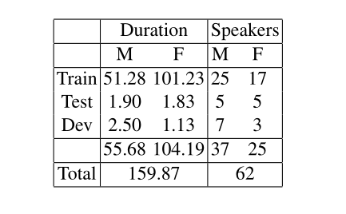
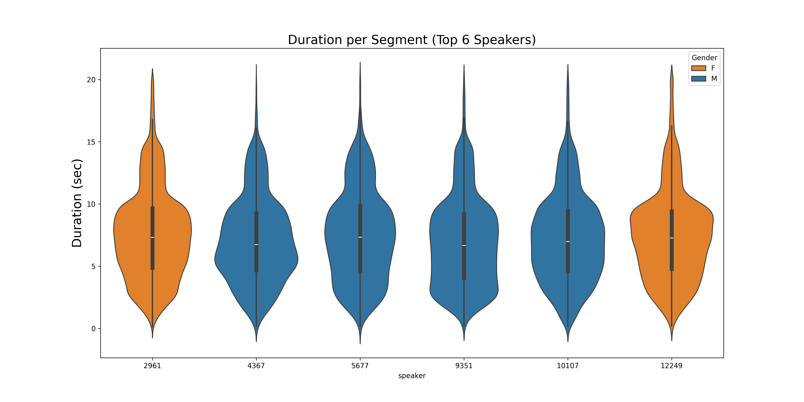
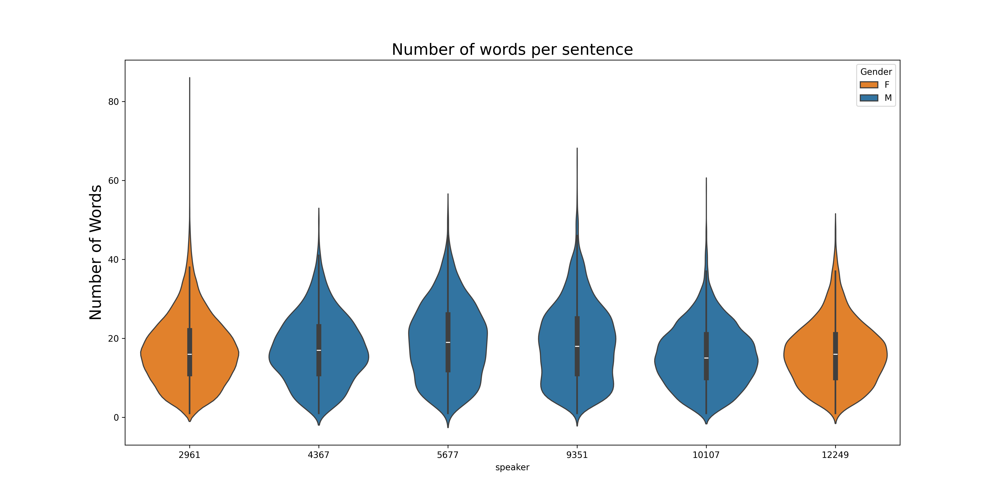

# BRSpeech: A high-quality dataset in Portuguese for speech synthesis

BRSpeech is a dataset for training Text-to-Speech (TTS) models in Portuguese, based on CML-TTS, developed at the Center of Excellence in Artificial Intelligence (CEIA) of the Federal University of Goias (UFG). BRSpeech has undergone a process to enhance the quality of audio files, and transcriptions were conducted using an Automatic Speech Recognition (ASR) tool and manually verified.. The dataset is available for download at [https://freds0.github.io/CML-TTS-Dataset/](https://freds0.github.io/CML-TTS-Dataset/) under the CC-BY 4.0 license.


## Download
To download the BRSpeech dataset, [click here](http://www.openslr.org/146/).

You can download it alternatively at:

- [BRSpeech Dataset](https://www.openslr.org/resources/146/cml_tts_dataset_portuguese_v0.1.tar.bz)

The segments files are available at [in this link](https://www.openslr.org/resources/146/cml_tts_dataset_segments_v0.1.tar.bz).

After downloading check the md5sum of each file:
```
0966023cea9c0f339dae464d0fcfe7f8  BRSpeech_CML_TTS_v14012024.tar.bz
```
## Statistics

BRSpeech is a dataset comprising audiobooks sourced from the public domain books of [Project Gutenberg](https://www.gutenberg.org/), read by volunteers from the [LibriVox](https://librivox.org/) project. The dataset includes recordings in Brazilian Portuguese and European Portuguese, all at a sampling rate of 48kHz. The following image shows some statistical information about the dataset.









## Audio Samples

To listen to samples from all the languages available in the BRSpeech dataset, as well as hear samples from models trained using BRSpeech, please visit our website [https://freds0.github.io/BRSpeech-Dataset/](https://freds0.github.io/BRSpeech-Dataset/).

## Citation

```
@InProceedings{Cmltts2023,
    title="CML-TTS: A Multilingual Dataset for Speech Synthesis in Low-Resource Languages",
    author="Oliveira, Frederico S. and Casanova, Edresson and Junior, Arnaldo Candido and Soares, Anderson S. and Galv{\~a}o Filho, Arlindo R.", 
    editor="Ek{\v{s}}tein, Kamil and P{\'a}rtl, Franti{\v{s}}ek and Konop{\'i}k, Miloslav",
    booktitle="Text, Speech, and Dialogue",
    year="2023",
    publisher="Springer Nature Switzerland",
    address="Cham",
    pages="188--199",
    isbn="978-3-031-40498-6"
}
```
