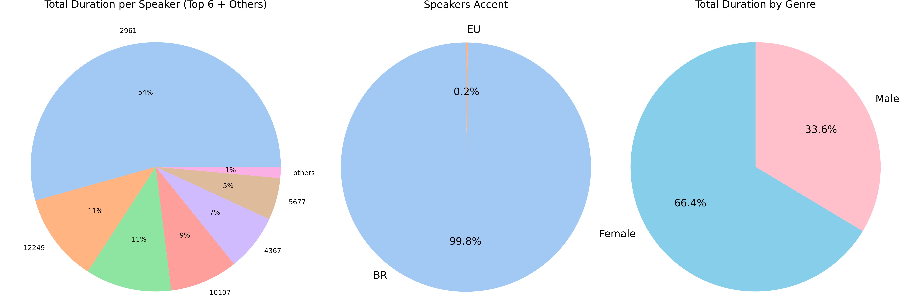

# BRSpeech: A high-quality dataset in Portuguese for speech synthesis

In this paper, we present BRSpeech, a recursive acronym for CML-Multi-Lingual-TTS, a new Text-to-Speech (TTS) dataset developed at the Center of Excellence in Artificial Intelligence (CEIA) of the Federal University of Goias (UFG). CML-TTS is based on Multilingual LibriSpeech (MLS) and adapted for training TTS models, consisting of audiobooks in seven languages: Dutch, French, German, Italian, Portuguese, Polish, and Spanish. Additionally, we provide the YourTTS model, a multi-lingual TTS model, trained using 3,176.13 hours from CML-TTS and also with 245.07 hours from LibriTTS, in English. Our purpose in creating this dataset is to open up new research possibilities in the TTS area for multi-lingual models. The dataset is available for download at [https://freds0.github.io/CML-TTS-Dataset/](https://freds0.github.io/CML-TTS-Dataset/) under the CC-BY 4.0 license.


## Download
To download the BRSpeech dataset, [click here](http://www.openslr.org/146/).

You can download each version separately:


- [BRSpeech Dataset](https://www.openslr.org/resources/146/cml_tts_dataset_portuguese_v0.1.tar.bz)

The segments files are available at [in this link](https://www.openslr.org/resources/146/cml_tts_dataset_segments_v0.1.tar.bz).

After downloading check the md5sum of each file:
```
8c877a4be0eb41f275497609df5a114c  cml_tts_dataset_portuguese_v0.1.tar.bz
f529a908aba26a6d891b4fb17ab3125b  cml_tts_dataset_segments_v0.1.tar.bz
```
## Statistics

BRSpeech is a dataset comprising audiobooks sourced from the public domain books of [Project Gutenberg](https://www.gutenberg.org/), read by volunteers from the [LibriVox](https://librivox.org/) project. The dataset includes recordings in Dutch, German, French, Italian, Polish, Portuguese, and Spanish, all at a sampling rate of 24kHz. The following figure shows pie charts indicating the percentage of each language's duration (on the left), sample quality percentage (in the center), and the percentage of speakers' gender (on the right).



The table below displays the total duration of each language subset present in the CML-TTS dataset, as well as the duration of the Train, Test, and Dev sets. Additionally, the table provides the duration of the sets categorized by speaker gender.


## Audio Samples

To listen to samples from all the languages available in the CML-TTS dataset, as well as hear the YourTTS model trained using CML-TTS in conjunction with LibriTTS, please visit our website [https://freds0.github.io/CML-TTS-Dataset/](https://freds0.github.io/CML-TTS-Dataset/).

## Citation

```
@InProceedings{Cmltts2023,
    title="CML-TTS: A Multilingual Dataset for Speech Synthesis in Low-Resource Languages",
    author="Oliveira, Frederico S. and Casanova, Edresson and Junior, Arnaldo Candido and Soares, Anderson S. and Galv{\~a}o Filho, Arlindo R.", 
    editor="Ek{\v{s}}tein, Kamil and P{\'a}rtl, Franti{\v{s}}ek and Konop{\'i}k, Miloslav",
    booktitle="Text, Speech, and Dialogue",
    year="2023",
    publisher="Springer Nature Switzerland",
    address="Cham",
    pages="188--199",
    isbn="978-3-031-40498-6"
}
```
